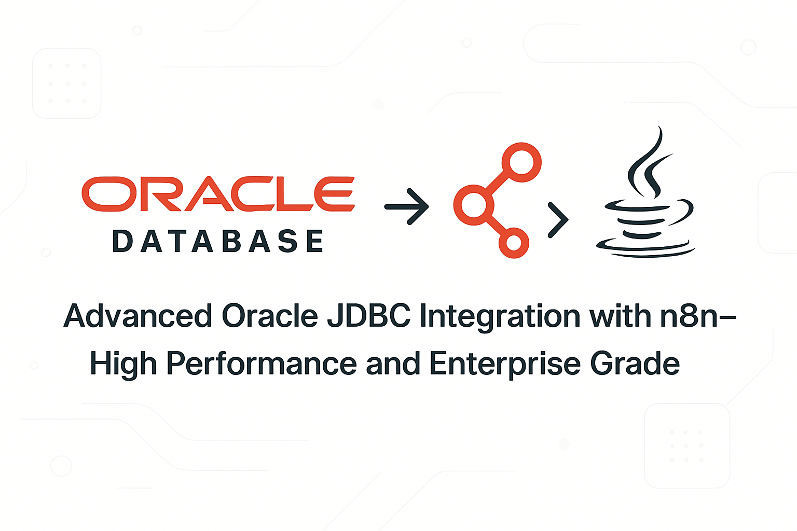

# oracle-jdbc-advanced-n8n



[](https://www.npmjs.com/package/oracle-jdbc-advanced-n8n)  
[](https://www.npmjs.com/package/oracle-jdbc-advanced-n8n)

🌎 **Languages | Idiomas:**  
[🇧🇷 Português](#-documentação-em-português) | [🇺🇸 English](#-documentation-in-english)

---

# 📖 Documentação em Português

# oracle-jdbc-advanced-n8n


[](https://www.npmjs.com/package/oracle-jdbc-advanced-n8n)
[](https://www.npmjs.com/package/oracle-jdbc-advanced-n8n)

Node avançado para **n8n** que integra Oracle Database via **JDBC nativo**, com recursos empresariais, pooling inteligente, gestão avançada de transações e suporte completo a workloads Oracle críticos.

---

## 📋 Sobre

Solução empresarial para integração entre n8n e bancos Oracle usando tecnologia JDBC oficial (ojdbc, UCP), Java Bridge e foco em alta performance, segurança e escalabilidade.

**Autor:** Jônatas Meireles Sousa Vieira  
**Email:** [jonatas.mei@outlook.com](mailto:jonatas.mei@outlook.com)  
**GitHub:** [@jonales](https://github.com/jonales)

---

## ⭐ Principais Recursos

- **JDBC Oracle Enterprise:** Thin, pooling UCP, failover, Oracle RAC e ADG
- **Pooling Avançado:** Pools configuráveis, monitoráveis e inteligentes
- **Batch Operations:** Inserts/updates massivos (bulk), processamento otimizado
- **Gestão de Transações:** Block ACID com savepoint, rollback parcial, isolamento
- **PL/SQL Completo:** Procedures, functions, packages, controle total de IN/OUT
- **Suporte Cloud:** Suporte OCI, Oracle Wallet, IAM integration
- **Connection Labeling:** Auditoria fina e rastreabilidade de sessões
- **Segurança:** SSL/TLS, Wallet, logs protegidos
- **Monitoração:** Estatísticas de pool, healthcheck, logging detalhado

---

## ⚙️ Instalação

```

npm install oracle-jdbc-advanced-n8n

```

> É necessário Java 11+ e os drivers Oracle JDBC (ojdbc11.jar, ucp.jar) no diretório `/lib`.  
> Use `npm run setup:java` para preparar o ambiente e veja orientações para baixar os drivers.

---

## 🔑 Configuração de Credenciais

No n8n, crie credenciais com os parâmetros:

| Campo             | Exemplo                           |
| ----------------- | --------------------------------- |
| Host              | `oracle-srv.exemplo.com`          |
| Port              | `1521`                            |
| Connection Type   | `service`/`sid`/`tns`             |
| Service Name      | `ORCL`, `PROD`, `XEPDB1`          |
| Username          | `app_user`                        |
| Password          | `**********`                      |
| Connection Options| Timeout, SSL, wallet, schema, ... |

#### Exemplos de Connection String

- Service: `oracle1.empresa.com:1521/PROD`
- TNS: `(DESCRIPTION=(ADDRESS=(PROTOCOL=TCP)(HOST=dbhost)(PORT=1521))(CONNECT_DATA=(SERVICE_NAME=MYDB)))`

---

## 🚀 Exemplos de Uso

### **Transação Completa**
```

INSERT INTO pedidos (cliente_id, valor) VALUES (:cli_id, :valor);
UPDATE estoque SET qtd = qtd - :qtd WHERE produto_id = :prod_id;
SAVEPOINT sp1;
DELETE FROM carrinho WHERE cliente_id = :cli_id;

```

### **Bulk Insert Otimizado**
Defina operação "batch", tabela de destino e lote de dados:
```

{
"operationType": "batch",
"tableName": "clientes",
"batchSize": 1000
}

```

### **Execução de Procedure**
```

{
"operationType": "procedure",
"procedureName": "atualiza_preco",
"parameters": [
{ "name": "p_produto_id", "type": "IN", "dataType": "NUMBER", "value": 123 },
{ "name": "p_novo_preco", "type": "IN", "dataType": "NUMBER", "value": 72.5 }
]
}

```

### **Pooling Empresarial**
```

import { PoolConfigurationPresets } from './core/AdvancedPoolConfig';

const poolConfig = PoolConfigurationPresets.getHighVolumeOLTP();

```

---

## 🏢 Pools de Conexão Inteligentes

| Tipo        | Min/Max | Timeout | Uso                       |
|-------------|---------|---------|---------------------------|
| Standard    | 5/20    | 30s     | Workloads gerais          |
| High OLTP   | 10/50   | 5s      | Altíssimo volume          |
| Analytics   | 5/20    | 300s    | Relatórios e consultas    |
| Cloud       | 5/25    | 60s     | Integrado ao OCI/Wallet   |
| RAC/ADG     | 8/40    | 10s     | Alta disponibilidade real |

---

## 📊 Monitoramento e Performance

- Batch testado para **centenas de milhares de registros**
- RAC/ADG failover suportado via `EnterpriseConnectionPool`
- Pool manager com estatísticas: conexões, borrow, available, peak, failed
- Statement cache configurável, health-check customizável

---

## 🛡️ Segurança

- Suporte nativo a **SSL/TLS**, Wallet, CA, client cert, etc.
- **Connection Labeling** para auditoria session-state
- Parâmetros bind obrigatórios (sem SQL Injection)
- Logs detalhados e stacktraces orientados para troubleshooting corporativo

---

## 🧪 Estrutura do Projeto

```

oracle-jdbc-advanced-n8n/
├── core/
│   ├── AdvancedPoolConfig.ts
│   ├── BatchOperations.ts
│   ├── ConnectionPool.ts
│   ├── EnterpriseConnectionPool.ts
│   ├── PoolManager.ts
│   ├── JdbcConnectionManager.ts
│   ├── OracleJdbcDriver.ts
│   ├── TransactionManager.ts
│   ├── QueryExecutor.ts
│   ├── StoredProcedureExecutor.ts
├── types/
│   ├── JdbcTypes.ts
│   ├── OracleTypes.ts
│   ├── ConfigTypes.ts
├── utils/
│   ├── ErrorHandler.ts
│   ├── ParameterBinder.ts
│   ├── ResultMapper.ts
│   ├── SqlParser.ts
├── scripts/
│   ├── download-jdbc.js
│   ├── setup-java.js
├── nodes/
│   └── OracleJdbcDatabase.node.ts
├── credentials/
│   └── OracleJdbc.credentials.ts
├── lib/
│   ├── ojdbc11.jar
│   ├── ucp.jar
│   └── orai18n.jar

```

---

## 🔧 Scripts e Desenvolvimento

```

npm run setup:java        \# Prepara ambiente Java
npm run download:jdbc     \# Orienta download dos drivers
npm run build             \# Build Typescript + assets
npm run dev               \# Hot reload / ambiente dev
npm run lint              \# ESLint + Prettier
npm run test              \# Testes automatizados
npm run validate          \# Checagem geral pré-release
npm run clean             \# Limpeza do dist

```

---

## 🤝 Contribuindo

Contribuições são **bem-vindas**!  
Siga o fluxo:

1. Fork
2. Branch de feature: `feature/nova-funcionalidade`
3. Commit e push
4. Pull-request explicativo  
Sugestões: correções, exemplos, otimizações, novos recursos, documentações, testes.

---

## 💰 Apoie este projeto

Se o projeto te ajuda, considere apoiar!

<div align="center">

### PIX:


**Chave PIX:** jonatas.mei@outlook.com

### Doação em Criptomoeda

<table style="width:100%; border:none;">
  <tr style="border:none;">
    <td style="text-align:center; padding:10px; border:none;">
      <h4>Bitcoin (BTC)</h4>
      
      <br>
      <code>bc1qdq9rj7565c4fvr7t3xut6z0tjd65p4mudrc0ll</code>
      <br>
      <a href="https://link.trustwallet.com/send?asset=c0&address=bc1qdq9rj7565c4fvr7t3xut6z0tjd65p4mudrc0ll">Pagar com Trust Wallet</a>
    </td>
    <td style="text-align:center; padding:10px; border:none;">
      <h4>Ethereum (ETH)</h4>
      
      <br>
      <code>0xA35A984401Ae9c81ca2d742977E603421df45419</code>
      <br>
      <a href="https://link.trustwallet.com/send?address=0xA35A984401Ae9c81ca2d742977E603421df45419&asset=c60">Pagar com Trust Wallet</a>
    </td>
  </tr>
  <tr style="border:none;">
    <td style="text-align:center; padding:10px; border:none;">
      <h4>BNB</h4>
      
      <br>
      <code>0xA35A984401Ae9c81ca2d742977E603421df45419</code>
      <br>
      <a href="https://link.trustwallet.com/send?address=0xA35A984401Ae9c81ca2d742977E603421df45419&asset=c20000714">Pagar com Trust Wallet</a>
    </td>
    <td style="text-align:center; padding:10px; border:none;">
      <h4>Polygon (POL)</h4>
      
      <br>
      <code>0xA35A984401Ae9c81ca2d742977E603421df45419</code>
      <br>
      <a href="https://link.trustwallet.com/send?asset=c966&address=0xA35A984401Ae9c81ca2d742977E603421df45419">Pagar com Trust Wallet</a>
    </td>
  </tr>
</table>

</div>

---

## 📄 Licença

Este projeto está licenciado sob a **Licença MIT** - veja o arquivo [LICENSE.md](LICENSE.md) para detalhes.

```

MIT License

Copyright (c) 2025 Jônatas Meireles Sousa Vieira

Permission is hereby granted, free of charge, to any person obtaining a copy
of this software and associated documentation files (the "Software"), to deal
in the Software without restriction, including without limitation the rights
to use, copy, modify, merge, publish, distribute, sublicense, and/or sell
copies of the Software, and to permit persons to whom the Software is
furnished to do so, subject to the following conditions:

The above copyright notice and this permission notice shall be included in all
copies or substantial portions of the Software.

THE SOFTWARE IS PROVIDED "AS IS", WITHOUT WARRANTY OF ANY KIND, EXPRESS OR
IMPLIED, INCLUDING BUT NOT LIMITED TO THE WARRANTIES OF MERCHANTABILITY,
FITNESS FOR A PARTICULAR PURPOSE AND NONINFRINGEMENT. IN NO EVENT SHALL THE
AUTHORS OR COPYRIGHT HOLDERS BE LIABLE FOR ANY CLAIM, DAMAGES OR OTHER
LIABILITY, WHETHER IN AN ACTION OF CONTRACT, TORT OR OTHERWISE, ARISING FROM,
OUT OF OR IN CONNECTION WITH THE SOFTWARE OR THE USE OR OTHER DEALINGS IN THE
SOFTWARE.

```

---

## 👨‍💻 Autor

**Jônatas Meireles Sousa Vieira**  
📧 [jonatas.mei@outlook.com](mailto:jonatas.mei@outlook.com)  
🔗 [github.com/jonales](https://github.com/jonales)  
🌐 [LinkedIn](https://www.linkedin.com/in/jonatasmeireles/)

---

## 📚 Links

- [Oracle Database Documentation](https://docs.oracle.com/en/database/oracle/oracle-database/)
- [n8n Community Nodes](https://docs.n8n.io/integrations/community-nodes/)
- [Report Issues](https://github.com/jonales/oracle-jdbc-advanced-n8n/issues)
- [Discussions](https://github.com/jonales/oracle-jdbc-advanced-n8n/discussions)

---

<div align="center">

**⭐ Dê uma estrela se gostou!**

[](https://github.com/jonales/oracle-jdbc-advanced-n8n)
[](https://github.com/jonales/oracle-jdbc-advanced-n8n/fork)

Made with ❤️ 100% autoral, sem forks de terceiros!

</div>


---

# 📖 Documentation in English

# oracle-jdbc-advanced-n8n


[](https://www.npmjs.com/package/oracle-jdbc-advanced-n8n)  
[](https://www.npmjs.com/package/oracle-jdbc-advanced-n8n)

Advanced node for **n8n** that integrates Oracle Database via **native JDBC**, with enterprise features, smart pooling, advanced transaction management, and full support for critical Oracle workloads.

---

## 📋 About

Enterprise-grade solution for integrating n8n with Oracle databases using official JDBC technology (ojdbc, UCP), Java Bridge, focusing on high performance, security, and scalability.

**Author:** Jônatas Meireles Sousa Vieira  
**Email:** [jonatas.mei@outlook.com](mailto:jonatas.mei@outlook.com)  
**GitHub:** [@jonales](https://github.com/jonales)

---

## ⭐ Main Features

- **Oracle Enterprise JDBC:** Thin, UCP pooling, failover, Oracle RAC and ADG  
- **Advanced Pooling:** Configurable, monitorable, and intelligent pools  
- **Batch Operations:** Massive inserts/updates (bulk), optimized processing  
- **Transaction Management:** ACID block with savepoint, partial rollback, isolation  
- **Full PL/SQL Support:** Procedures, functions, packages, complete IN/OUT control  
- **Cloud Support:** OCI, Oracle Wallet, IAM integration  
- **Connection Labeling:** Fine-grained auditing and session traceability  
- **Security:** SSL/TLS, Wallet, protected logs  
- **Monitoring:** Pool statistics, health checks, detailed logging  

---

## ⚙️ Installation

```bash
npm install oracle-jdbc-advanced-n8n
```

> Requires Java 11+ and Oracle JDBC drivers (ojdbc11.jar, ucp.jar) inside `/lib`.  
> Use `npm run setup:java` to prepare the environment and check the instructions to download the drivers.

---

## 🔑 Credential Configuration

In n8n, create credentials with the following parameters:

| Field             | Example                           |
| ----------------- | --------------------------------- |
| Host              | `oracle-srv.example.com`          |
| Port              | `1521`                            |
| Connection Type   | `service` / `sid` / `tns`         |
| Service Name      | `ORCL`, `PROD`, `XEPDB1`          |
| Username          | `app_user`                        |
| Password          | `**********`                      |
| Connection Options| Timeout, SSL, wallet, schema, ... |

#### Connection String Examples

- Service: `oracle1.company.com:1521/PROD`  
- TNS: `(DESCRIPTION=(ADDRESS=(PROTOCOL=TCP)(HOST=dbhost)(PORT=1521))(CONNECT_DATA=(SERVICE_NAME=MYDB)))`

---

## 🚀 Usage Examples

### **Full Transaction**
```sql
INSERT INTO orders (customer_id, amount) VALUES (:cust_id, :amount);
UPDATE stock SET qty = qty - :qty WHERE product_id = :prod_id;
SAVEPOINT sp1;
DELETE FROM cart WHERE customer_id = :cust_id;
```

### **Optimized Bulk Insert**
Define operation type as "batch", target table, and data batch:
```json
{
  "operationType": "batch",
  "tableName": "customers",
  "batchSize": 1000
}
```

### **Procedure Execution**
```json
{
  "operationType": "procedure",
  "procedureName": "update_price",
  "parameters": [
    { "name": "p_product_id", "type": "IN", "dataType": "NUMBER", "value": 123 },
    { "name": "p_new_price", "type": "IN", "dataType": "NUMBER", "value": 72.5 }
  ]
}
```

### **Enterprise Pooling**
```ts
import { PoolConfigurationPresets } from './core/AdvancedPoolConfig';

const poolConfig = PoolConfigurationPresets.getHighVolumeOLTP();
```

---

## 🏢 Intelligent Connection Pools

| Type        | Min/Max | Timeout | Use Case                 |
|-------------|---------|---------|--------------------------|
| Standard    | 5/20    | 30s     | General workloads         |
| High OLTP   | 10/50   | 5s      | Very high transaction volume |
| Analytics   | 5/20    | 300s    | Reports and queries       |
| Cloud       | 5/25    | 60s     | Integrated with OCI/Wallet|
| RAC/ADG     | 8/40    | 10s     | High availability setups  |

---

## 📊 Monitoring and Performance

- Batch tested with **hundreds of thousands of records**  
- RAC/ADG failover supported via `EnterpriseConnectionPool`  
- Pool manager with statistics: connections, borrowed, available, peak, failed  
- Configurable statement cache, customizable health-check  

---

## 🛡️ Security

- Native support for **SSL/TLS**, Wallet, CA, client certs, etc.  
- **Connection Labeling** for session-state auditing  
- Mandatory bind parameters (SQL Injection proof)  
- Detailed logs and stack traces for enterprise troubleshooting  

---

## 🧪 Project Structure

```text
oracle-jdbc-advanced-n8n/
├── core/
│   ├── AdvancedPoolConfig.ts
│   ├── BatchOperations.ts
│   ├── ConnectionPool.ts
│   ├── EnterpriseConnectionPool.ts
│   ├── PoolManager.ts
│   ├── JdbcConnectionManager.ts
│   ├── OracleJdbcDriver.ts
│   ├── TransactionManager.ts
│   ├── QueryExecutor.ts
│   ├── StoredProcedureExecutor.ts
├── types/
│   ├── JdbcTypes.ts
│   ├── OracleTypes.ts
│   ├── ConfigTypes.ts
├── utils/
│   ├── ErrorHandler.ts
│   ├── ParameterBinder.ts
│   ├── ResultMapper.ts
│   ├── SqlParser.ts
├── scripts/
│   ├── download-jdbc.js
│   ├── setup-java.js
├── nodes/
│   └── OracleJdbcDatabase.node.ts
├── credentials/
│   └── OracleJdbc.credentials.ts
├── lib/
│   ├── ojdbc11.jar
│   ├── ucp.jar
│   └── orai18n.jar
```

---

## 🔧 Scripts and Development

```bash
npm run setup:java        # Prepare Java environment
npm run download:jdbc     # Download JDBC drivers
npm run build             # Build Typescript + assets
npm run dev               # Hot reload / dev environment
npm run lint              # ESLint + Prettier
npm run test              # Automated tests
npm run validate          # Pre-release checks
npm run clean             # Cleanup dist folder
```

---

## 🤝 Contributing

Contributions are **welcome**!  
Follow this flow:

1. Fork  
2. Feature branch: `feature/new-feature`  
3. Commit and push  
4. Submit a descriptive pull request  

Suggestions: bug fixes, examples, optimizations, new features, docs, tests.

---

## 💰 Support This Project

If this project helps you, consider supporting it!

<div align="center">

### PIX:
  

**PIX Key:** jonatas.mei@outlook.com  

### Cryptocurrency Donation

<table style="width:100%; border:none;">
  <tr style="border:none;">
    <td style="text-align:center; padding:10px; border:none;">
      <h4>Bitcoin (BTC)</h4>
      
      <br>
      <code>bc1qdq9rj7565c4fvr7t3xut6z0tjd65p4mudrc0ll</code>
      <br>
      <a href="https://link.trustwallet.com/send?asset=c0&address=bc1qdq9rj7565c4fvr7t3xut6z0tjd65p4mudrc0ll">Pay with Trust Wallet</a>
    </td>
    <td style="text-align:center; padding:10px; border:none;">
      <h4>Ethereum (ETH)</h4>
      
      <br>
      <code>0xA35A984401Ae9c81ca2d742977E603421df45419</code>
      <br>
      <a href="https://link.trustwallet.com/send?address=0xA35A984401Ae9c81ca2d742977E603421df45419&asset=c60">Pay with Trust Wallet</a>
    </td>
  </tr>
  <tr style="border:none;">
    <td style="text-align:center; padding:10px; border:none;">
      <h4>BNB</h4>
      
      <br>
      <code>0xA35A984401Ae9c81ca2d742977E603421df45419</code>
      <br>
      <a href="https://link.trustwallet.com/send?address=0xA35A984401Ae9c81ca2d742977E603421df45419&asset=c20000714">Pay with Trust Wallet</a>
    </td>
    <td style="text-align:center; padding:10px; border:none;">
      <h4>Polygon (POL)</h4>
      
      <br>
      <code>0xA35A984401Ae9c81ca2d742977E603421df45419</code>
      <br>
      <a href="https://link.trustwallet.com/send?asset=c966&address=0xA35A984401Ae9c81ca2d742977E603421df45419">Pay with Trust Wallet</a>
    </td>
  </tr>
</table>


---

## 📄 License

This project is licensed under the **MIT License** – see [LICENSE.md](LICENSE.md) for details.

---

## 👨‍💻 Author

**Jônatas Meireles Sousa Vieira**  
📧 [jonatas.mei@outlook.com](mailto:jonatas.mei@outlook.com)  
🔗 [github.com/jonales](https://github.com/jonales)  
🌐 [LinkedIn](https://www.linkedin.com/in/jonatasmeireles/)

---

## 📚 Links

- [Oracle Database Documentation](https://docs.oracle.com/en/database/oracle/oracle-database/)  
- [n8n Community Nodes](https://docs.n8n.io/integrations/community-nodes/)  
- [Report Issues](https://github.com/jonales/oracle-jdbc-advanced-n8n/issues)  
- [Discussions](https://github.com/jonales/oracle-jdbc-advanced-n8n/discussions)  

---

<div align="center">

**⭐ Star if you like it!**  

[](https://github.com/jonales/oracle-jdbc-advanced-n8n)  
[](https://github.com/jonales/oracle-jdbc-advanced-n8n/fork)  

Made with ❤️ 100% original, no third-party forks!  

</div>